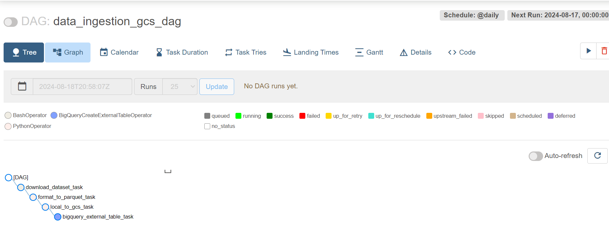

# Learning in Public

This repository serves as a record of my learning journey, where I track and outline the resources I've used. My focus is on Machine Learning (including MLOps and ML Engineering), Data Science, Data Engineering, and Programming. 
I try to learn by implementing in code.  

| | Resources | Status of Completion |
| - | :-: | :-: |
| 1 | [**DataTalksClub Data Engineering Zoomcamp**](https://github.com/DataTalksClub/data-engineering-zoomcamp) | Paused until January |
| 2 | [**DataTalksClub Machine Learning Zoomcamp**](https://github.com/DataTalksClub/machine-learning-zoomcamp) | Ongoing |

| | Projects and Notebooks |
| - | :-: |
| 1 | [**My repo for Data Engineering Zoomcamp**](https://github.com/kemaldahha/data-engineering-course/) |
| 2 | [**My repo for Machine Learning Zoomcamp**](https://github.com/kemaldahha/machine-learning-course/) |

## Day 0

Over the past month I have been going through the Data Engineering Zoomcamp by DataTalksClub. Here is a summary of what I covered so far.
- **Docker** is a platform that uses containers to create, deploy, and run applications. It's self-contained, so whatever you 'Dockerize' on a particular system (e.g. Windows), will run on any other machine (e.g. Linux) with Docker. Docker images are files which contain everything to run a piece of software (e.g. Postgres). You can download them from Docker Hub or make them yourself. The creation of Docker images can be automated using a Dockerfile. You can provide it arguments and instructions (e.g. to upload a file from your current working directory to a certain location in the image before running the software). When you run a Docker image, a container (instance of an image) is created. You can run multiple containers that communicate with each other. Containers are _ephemeral_, meaning that their state is not saved unless _volumes_ are used for persistence. Networks can be used to allow multiple containers to communicate with each other.
- I used a **Postgres** database. To inspect the data in postgres, I used both pgcli (command-line interface) as well as pgAdmin (browser interface).
- I did a refresher on **SQL**. It's been a while since I did SQL, because these days I use Pandas. But I will put some SQL practice on my roadmap down the line.
- **Terraform** was completely new to me. It's an Infrastructure-as-Code application which allows for convenient setup of Cloud resources. It's an easy to use abstraction layer on top of Cloud platforms such as GCP, Azure, AWS, and many others. Terraform commands are pretty straightforward: init, plan, apply, destroy. You can use variables in your Terraform .tf files.
- During this month, I used **Linux** extensively and learned about **SSH** and **port forwarding**.  

Resources:
- [My week 1 notes](https://github.com/kemaldahha/data-engineering-course/blob/main/week_1_notes.md) for [DataTalksClub Data Engineering Zoomcamp](https://github.com/DataTalksClub/data-engineering-zoomcamp)

## Day 1

**Workflow orchestration** tools such as Apache Airflow enable Data Engineers to organize and manage data pipelines/workflows. For example, consider a pipeline that involves downloading CSV data from the internet, reading the data, and storing it in a database. Executing these steps sequentially using a simple bash script, can be error-prone - if one step fails, the entire pipeline fails. Although you could circumvent this by writing code to retry upon failure, this approach becomes unwieldy as workflows grow in complexity. Workflow Orchestration address these challenges by simplifying retries, enabling parametrization of steps in the workflow, handling parallel execution, and providing tools to inspect logs and track execution history.

Resources:
- [My week 2 notes](https://github.com/kemaldahha/data-engineering-course/blob/main/week_2_notes.md) for [DataTalksClub Data Engineering Zoomcamp](https://github.com/DataTalksClub/data-engineering-zoomcamp)

## Day 2

Today I set up **Airflow** using Docker. I took a docker-compose.yaml file from the [Apache Airflow documentation](https://airflow.apache.org/docs/apache-airflow/stable/howto/docker-compose/index.html) and made adjustments to it to make it work with GCP. Running into an issue which I'll troubleshoot tomorrow. 

Resources:
- [My week 2 notes](https://github.com/kemaldahha/data-engineering-course/blob/main/week_2_notes.md) for [DataTalksClub Data Engineering Zoomcamp](https://github.com/DataTalksClub/data-engineering-zoomcamp)

## Day 3

I started today with troubleshooting yesterday's issue. Read more about it in [my notes](https://github.com/kemaldahha/data-engineering-course/blob/main/week_2_notes.md) and on the Stack Overflow answer I posted [here](https://stackoverflow.com/a/78877992/11486502). After fixing it, everything worked! In summary, I finalized the Airflow with Docker and Docker Compose setup by:
- creating the appropriate folder structure for Airflow
- setting the Airflow user id in a .env file 
- downloaded the docker-compose.yaml file from Airflow's documentation abd updated it to point to the course's Dockerfile which, on top of the Airflow Docker image, installs some dependencies specified in a requirements.txt and installs Google Cloud SDK.
- troubleshot an issue along the way

Resources:
- [My week 2 notes](https://github.com/kemaldahha/data-engineering-course/blob/main/week_2_notes.md) for [DataTalksClub Data Engineering Zoomcamp](https://github.com/DataTalksClub/data-engineering-zoomcamp)

## Day 4

Today I learned more about DAGs (Directed Acyclic Graph) in Airflow. A **DAG** is used to define the order in which tasks should be executed in a workflow. It specifies dependencies between tasks, has an explicit execution order, and has a beginning and an end. A **task** is a defined unit of work. It could be to fetch some data, run an analysis, trigger other systems, listen for events, etc. Airflow DAGs are defined in Python. There are various ways to declare one, such as with a context manager, a constructor, or a decorator.
Now that the Airflow environment has been set up, the next step will be to write an ingestion pipeline to ingest raw data into a GCP Cloud Storage Bucket. 

Resources:
- [My week 2 notes](https://github.com/kemaldahha/data-engineering-course/blob/main/week_2_notes.md) for [DataTalksClub Data Engineering Zoomcamp](https://github.com/DataTalksClub/data-engineering-zoomcamp)

## Day 5

Today I put what I learned into practice. 
Using **Terraform** I set up the Google Cloud infrastructure: **Bucket** for raw data storage and a **BigQuery Table** for the extracted, structured data from the Bucket.
Then, using **Airflow** within a **Docker container**, I executed a **DAG** which downloads a CSV dataset, **parquetizes** it, uploads it to the Google Cloud **Bucket**, and subsequently stores it in the **BigQuery** table, where it can be easily queried. Using **Airflow** I can ensure the **tasks** are run in order, when I want, under the conditions I want, and I can easily inspect and visualize what has happened.
I am starting to see the big picture and how the different tools work together as a system.

Resources:
- [My week 2 notes](https://github.com/kemaldahha/data-engineering-course/blob/main/week_2_notes.md) for [DataTalksClub Data Engineering Zoomcamp](https://github.com/DataTalksClub/data-engineering-zoomcamp)

## Day 6

More practice with Airflow by converting the data ingestion script from week 1 into a DAG and setting up Airflow. Running into errors due to conflicting Airflow/Postgres database setups. Trying to figure things out still. On holiday for the next 10 days, so I'll pick back up after.

Resources:
- [My week 2 notes](https://github.com/kemaldahha/data-engineering-course/blob/main/week_2_notes.md) for [DataTalksClub Data Engineering Zoomcamp](https://github.com/DataTalksClub/data-engineering-zoomcamp)

## Day 7

Back from holiday. With the [DataTalksClub Machine Learning Zoomcamp](https://github.com/DataTalksClub/machine-learning-zoomcamp) course starting in a week, I decided to pause my self-paced study of the [Data Engineering Zoomcamp](https://github.com/DataTalksClub/data-engineering-zoomcamp) and follow along with ML Zoomcamp. My priority is to do the project work and build my portfolio. Following along will facilitate that better. After finishing the ML Zoomcamp, I will pick up the DE Zoomcamp again which starts in January.

Today I reviewed the fundamentals of ML, such as features, target variables, training/fitting a model, supervised ML, regression, classification (binary and multi-class), ranking. Also I learned how ML systems differ from rule-based systems. With ML the model decides which rules are important and which ones aren't. This helps to avoid building rule-based systems with a myriad of rules and conditions that become impossible to maintain over time.

Resources:
- [My week 1 notes](https://github.com/kemaldahha/machine-learning-course/blob/main/week_1_notes.md) for [DataTalksClub Machine Learning Zoomcamp](https://github.com/DataTalksClub/machine-learning-zoomcamp)

## Day 8

Today I continued with the week 1 videos from ML Zoomcamp. I learned about CRISP-DM which is a methodology for Data Science projects. I set up my environment in WSL2 using Anaconda and learned about ML model selection using train-validation-test splits and why it is important to avoid models 'getting lucky' due to their probabilistic nature (Multiple Comparison Problem). Finally, I went through a Numpy refresher.

Resources:
- [My week 1 notes](https://github.com/kemaldahha/machine-learning-course/blob/main/week_1_notes.md) for [DataTalksClub Machine Learning Zoomcamp](https://github.com/DataTalksClub/machine-learning-zoomcamp)

## Day 9

Halfway through the linear algebra refresher in week 1 of ML Zoomcamp. Covered vectors, matrices, and dot products.

Resources:
- [My week 1 notes](https://github.com/kemaldahha/machine-learning-course/blob/main/week_1_notes.md) for [DataTalksClub Machine Learning Zoomcamp](https://github.com/DataTalksClub/machine-learning-zoomcamp)

## Day 10

I finished the linear algebra refresher in which I dot product, matrix-vector multiplication, matrix-matrix multiplication, the identity matrix, and the matrix inverse. Implemented it in Numpy. Next up: Pandas refresher. 

Resources:
- [My week 1 notes](https://github.com/kemaldahha/machine-learning-course/blob/main/week_1_notes.md) for [DataTalksClub Machine Learning Zoomcamp](https://github.com/DataTalksClub/machine-learning-zoomcamp)

## Day 11

Today I studied an intro to Pandas. Pandas is a powerful data analysis library in Python to analyze tabular data. There are two Pandas datatypes: DataFrame and Series. A DataFrame's is like a table, its columns consist of Series. I reviewed all the basic operations on DataFrames, such as accessing elements, filtering with masks, groupby. 

Resources:
- [My week 1 notes](https://github.com/kemaldahha/machine-learning-course/blob/main/week_1_notes.md) for [DataTalksClub Machine Learning Zoomcamp](https://github.com/DataTalksClub/machine-learning-zoomcamp)