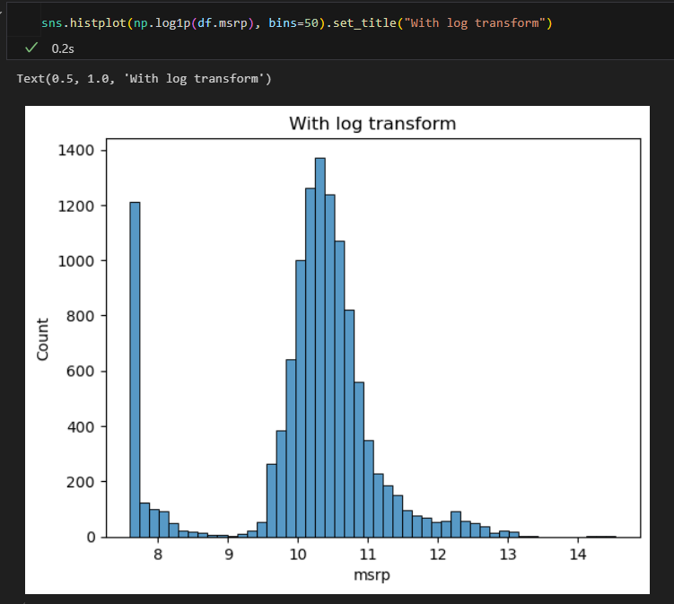
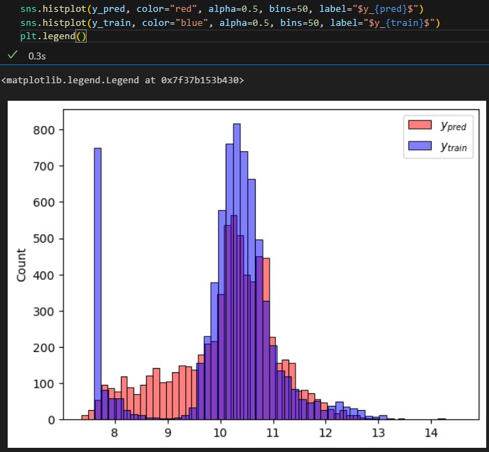
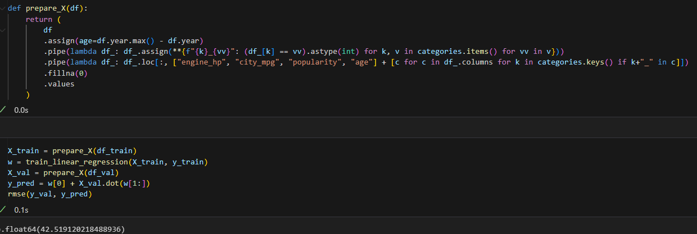

# Learning in Public

This repository serves as a record of my learning journey, where I track and outline the resources I've used. My focus is on Machine Learning (including MLOps and ML Engineering), Data Science, Data Engineering, and Programming. 
I try to learn by implementing in code.  

| | Resource | Personal Notes/Projects | Status of Completion |
| - | :-: | :-: | :-: |
| 1 | [**DataTalksClub Data Engineering Zoomcamp**](https://github.com/DataTalksClub/data-engineering-zoomcamp) | [**Data Engineering Zoomcamp**](https://github.com/kemaldahha/data-engineering-course/) | Paused until January |
| 2 | [**DataTalksClub Machine Learning Zoomcamp**](https://github.com/DataTalksClub/machine-learning-zoomcamp) | [**Machine Learning Zoomcamp**](https://github.com/kemaldahha/machine-learning-course/) | Ongoing |

## Day 0

Over the past month I have been going through the Data Engineering Zoomcamp by DataTalksClub. Here is a summary of what I covered so far.
- **Docker** is a platform that uses containers to create, deploy, and run applications. It's self-contained, so whatever you 'Dockerize' on a particular system (e.g. Windows), will run on any other machine (e.g. Linux) with Docker. Docker images are files which contain everything to run a piece of software (e.g. Postgres). You can download them from Docker Hub or make them yourself. The creation of Docker images can be automated using a Dockerfile. You can provide it arguments and instructions (e.g. to upload a file from your current working directory to a certain location in the image before running the software). When you run a Docker image, a container (instance of an image) is created. You can run multiple containers that communicate with each other. Containers are _ephemeral_, meaning that their state is not saved unless _volumes_ are used for persistence. Networks can be used to allow multiple containers to communicate with each other.
- I used a **Postgres** database. To inspect the data in postgres, I used both pgcli (command-line interface) as well as pgAdmin (browser interface).
- I did a refresher on **SQL**. It's been a while since I did SQL, because these days I use Pandas. But I will put some SQL practice on my roadmap down the line.
- **Terraform** was completely new to me. It's an Infrastructure-as-Code application which allows for convenient setup of Cloud resources. It's an easy to use abstraction layer on top of Cloud platforms such as GCP, Azure, AWS, and many others. Terraform commands are pretty straightforward: init, plan, apply, destroy. You can use variables in your Terraform .tf files.
- During this month, I used **Linux** extensively and learned about **SSH** and **port forwarding**.  

Resources:
- [My week 1 notes](https://github.com/kemaldahha/data-engineering-course/blob/main/week_1_notes.md) for [DataTalksClub Data Engineering Zoomcamp](https://github.com/DataTalksClub/data-engineering-zoomcamp)

## Day 1

**Workflow orchestration** tools such as Apache Airflow enable Data Engineers to organize and manage data pipelines/workflows. For example, consider a pipeline that involves downloading CSV data from the internet, reading the data, and storing it in a database. Executing these steps sequentially using a simple bash script, can be error-prone - if one step fails, the entire pipeline fails. Although you could circumvent this by writing code to retry upon failure, this approach becomes unwieldy as workflows grow in complexity. Workflow Orchestration address these challenges by simplifying retries, enabling parametrization of steps in the workflow, handling parallel execution, and providing tools to inspect logs and track execution history.

Resources:
- [My week 2 notes](https://github.com/kemaldahha/data-engineering-course/blob/main/week_2_notes.md) for [DataTalksClub Data Engineering Zoomcamp](https://github.com/DataTalksClub/data-engineering-zoomcamp)

## Day 2

Today I set up **Airflow** using Docker. I took a docker-compose.yaml file from the [Apache Airflow documentation](https://airflow.apache.org/docs/apache-airflow/stable/howto/docker-compose/index.html) and made adjustments to it to make it work with GCP. Running into an issue which I'll troubleshoot tomorrow. 

Resources:
- [My week 2 notes](https://github.com/kemaldahha/data-engineering-course/blob/main/week_2_notes.md) for [DataTalksClub Data Engineering Zoomcamp](https://github.com/DataTalksClub/data-engineering-zoomcamp)

## Day 3

I started today with troubleshooting yesterday's issue. Read more about it in [my notes](https://github.com/kemaldahha/data-engineering-course/blob/main/week_2_notes.md) and on the Stack Overflow answer I posted [here](https://stackoverflow.com/a/78877992/11486502). After fixing it, everything worked! In summary, I finalized the Airflow with Docker and Docker Compose setup by:
- creating the appropriate folder structure for Airflow
- setting the Airflow user id in a .env file 
- downloaded the docker-compose.yaml file from Airflow's documentation abd updated it to point to the course's Dockerfile which, on top of the Airflow Docker image, installs some dependencies specified in a requirements.txt and installs Google Cloud SDK.
- troubleshot an issue along the way

Resources:
- [My week 2 notes](https://github.com/kemaldahha/data-engineering-course/blob/main/week_2_notes.md) for [DataTalksClub Data Engineering Zoomcamp](https://github.com/DataTalksClub/data-engineering-zoomcamp)

## Day 4

Today I learned more about DAGs (Directed Acyclic Graph) in Airflow. A **DAG** is used to define the order in which tasks should be executed in a workflow. It specifies dependencies between tasks, has an explicit execution order, and has a beginning and an end. A **task** is a defined unit of work. It could be to fetch some data, run an analysis, trigger other systems, listen for events, etc. Airflow DAGs are defined in Python. There are various ways to declare one, such as with a context manager, a constructor, or a decorator.
Now that the Airflow environment has been set up, the next step will be to write an ingestion pipeline to ingest raw data into a GCP Cloud Storage Bucket. 

Resources:
- [My week 2 notes](https://github.com/kemaldahha/data-engineering-course/blob/main/week_2_notes.md) for [DataTalksClub Data Engineering Zoomcamp](https://github.com/DataTalksClub/data-engineering-zoomcamp)

## Day 5

Today I put what I learned into practice. 
Using **Terraform** I set up the Google Cloud infrastructure: **Bucket** for raw data storage and a **BigQuery Table** for the extracted, structured data from the Bucket.
Then, using **Airflow** within a **Docker container**, I executed a **DAG** which downloads a CSV dataset, **parquetizes** it, uploads it to the Google Cloud **Bucket**, and subsequently stores it in the **BigQuery** table, where it can be easily queried. Using **Airflow** I can ensure the **tasks** are run in order, when I want, under the conditions I want, and I can easily inspect and visualize what has happened.
I am starting to see the big picture and how the different tools work together as a system.

Resources:
- [My week 2 notes](https://github.com/kemaldahha/data-engineering-course/blob/main/week_2_notes.md) for [DataTalksClub Data Engineering Zoomcamp](https://github.com/DataTalksClub/data-engineering-zoomcamp)

## Day 6

More practice with Airflow by converting the data ingestion script from week 1 into a DAG and setting up Airflow. Running into errors due to conflicting Airflow/Postgres database setups. Trying to figure things out still. On holiday for the next 10 days, so I'll pick back up after.

Resources:
- [My week 2 notes](https://github.com/kemaldahha/data-engineering-course/blob/main/week_2_notes.md) for [DataTalksClub Data Engineering Zoomcamp](https://github.com/DataTalksClub/data-engineering-zoomcamp)

## Day 7

Back from holiday. With the [DataTalksClub Machine Learning Zoomcamp](https://github.com/DataTalksClub/machine-learning-zoomcamp) course starting in a week, I decided to pause my self-paced study of the [Data Engineering Zoomcamp](https://github.com/DataTalksClub/data-engineering-zoomcamp) and follow along with ML Zoomcamp. My priority is to do the project work and build my portfolio. Following along will facilitate that better. After finishing the ML Zoomcamp, I will pick up the DE Zoomcamp again which starts in January.

Today I reviewed the fundamentals of ML, such as features, target variables, training/fitting a model, supervised ML, regression, classification (binary and multi-class), ranking. Also I learned how ML systems differ from rule-based systems. With ML the model decides which rules are important and which ones aren't. This helps to avoid building rule-based systems with a myriad of rules and conditions that become impossible to maintain over time.

Resources:
- [My week 1 notes](https://github.com/kemaldahha/machine-learning-course/blob/main/week_1_notes.md) for [DataTalksClub Machine Learning Zoomcamp](https://github.com/DataTalksClub/machine-learning-zoomcamp)

## Day 8

Today I continued with the week 1 videos from ML Zoomcamp. I learned about CRISP-DM which is a methodology for Data Science projects. I set up my environment in WSL2 using Anaconda and learned about ML model selection using train-validation-test splits and why it is important to avoid models 'getting lucky' due to their probabilistic nature (Multiple Comparison Problem). Finally, I went through a Numpy refresher.

Resources:
- [My week 1 notes](https://github.com/kemaldahha/machine-learning-course/blob/main/week_1_notes.md) for [DataTalksClub Machine Learning Zoomcamp](https://github.com/DataTalksClub/machine-learning-zoomcamp)

## Day 9

Halfway through the linear algebra refresher in week 1 of ML Zoomcamp. Covered vectors, matrices, and dot products.

Resources:
- [My week 1 notes](https://github.com/kemaldahha/machine-learning-course/blob/main/week_1_notes.md) for [DataTalksClub Machine Learning Zoomcamp](https://github.com/DataTalksClub/machine-learning-zoomcamp)

## Day 10

I finished the linear algebra refresher in which I dot product, matrix-vector multiplication, matrix-matrix multiplication, the identity matrix, and the matrix inverse. Implemented it in Numpy. Next up: Pandas refresher. 

Resources:
- [My week 1 notes](https://github.com/kemaldahha/machine-learning-course/blob/main/week_1_notes.md) for [DataTalksClub Machine Learning Zoomcamp](https://github.com/DataTalksClub/machine-learning-zoomcamp)

## Day 11

Today I studied an intro to Pandas. Pandas is a powerful data analysis library in Python to analyze tabular data. There are two Pandas datatypes: DataFrame and Series. A DataFrame's is like a table, its columns consist of Series. I reviewed all the basic operations on DataFrames, such as accessing elements, filtering with masks, groupby. 

Resources:
- [My week 1 notes](https://github.com/kemaldahha/machine-learning-course/blob/main/week_1_notes.md) for [DataTalksClub Machine Learning Zoomcamp](https://github.com/DataTalksClub/machine-learning-zoomcamp)

## Day 12

The second week goes through the entire lifecycle of setting up a regression ML model for a car price prediction dataset.  I learned about data preparation/cleaning, EDA, and model validation. Ensuring training/validation/testing are representative is crucial.

Resources:
- [My week 2 notes](https://github.com/kemaldahha/machine-learning-course/blob/main/week_2_notebook.ipynb) for [DataTalksClub Machine Learning Zoomcamp](https://github.com/DataTalksClub/machine-learning-zoomcamp)

## Day 13

In linear regression models, feature values are multiplied with weights. The sum of these products yield a prediction of the target variable. This is done for each sample (i.e. row) in the training set. If a certain feature has a high weight, it means that that feature is very important for predicting the target variable. I set up a function for linear regression for a single sample. Then I extended it to the entire training set and wrote it in terms of a matrix-vector multiplication. 

Resources:
- [My week 2 notes](https://github.com/kemaldahha/machine-learning-course/blob/main/week_2_notes.ipynb) for [DataTalksClub Machine Learning Zoomcamp](https://github.com/DataTalksClub/machine-learning-zoomcamp)

## Day 14

The Normal Equation solves for the weights in a linear regression problem such that the sum of squared errors is minimized between the data and the model.

Resources:
- [My week 2 notes](https://github.com/kemaldahha/machine-learning-course/blob/main/week_2_notes.ipynb) for [DataTalksClub Machine Learning Zoomcamp](https://github.com/DataTalksClub/machine-learning-zoomcamp)

## Day 15

I created a baseline model for the car price prediction dataset. This was done by selecting numeric features only, filling nans with 0, splitting the data into train/validation/test, and using the Normal equation on on the train data. I visualized the results below. Also I calculated the Root Mean Square Error (RMSE), which is a common metric for evaluating regression models.

Resources:
- [My week 2 notes](https://github.com/kemaldahha/machine-learning-course/blob/main/week_2_notes.ipynb) for [DataTalksClub Machine Learning Zoomcamp](https://github.com/DataTalksClub/machine-learning-zoomcamp)

## Day 16

Feature engineering is used to transform the data you have into new features. For instance the cars dataset I am looking at has a 'year' feature. I changed this into 'age', which improved the car price prediction. Categorical columns can be converted into binary columns for each category. However if you have too many features, your RMSE will go up and so will your weights. A way to deal with this is regularization.

Resources:
- [My week 2 notes](https://github.com/kemaldahha/machine-learning-course/blob/main/week_2_notes.ipynb) for [DataTalksClub Machine Learning Zoomcamp](https://github.com/DataTalksClub/machine-learning-zoomcamp)

## Day 17

Learned about what happens when there are linearly dependent columns in the feature matrix X. In that case, X^T X in the Normal Equation becomes rank deficient and cannot be inverted. Or, if the columns are near linear dependent, it leads to numerical instability and very large weights. Regularization (Ridge/L2) can counter this. We add a small number to the diagnotal of X^T X which makes it invertible. The amount of regularization we apply is a hyperparameter that needs to be optimized. Besides this, I started writing a blog post about linear regression.

Resources:
- [My week 2 notes](https://github.com/kemaldahha/machine-learning-course/blob/main/week_2_notes.ipynb) for [DataTalksClub Machine Learning Zoomcamp](https://github.com/DataTalksClub/machine-learning-zoomcamp)
- [On Linear Regression (WIP)](https://github.com/kemaldahha/machine-learning-course/blob/main/linear_regression_article.ipynb)

## Day 18

Continued blog post on Linear Regression. Finalized formal derivation of Normal Equation. Next, explain why Numpy and sklearn (and LAPACK under the hood) use SVD/QR decomposition instead. Also started putting notes on fundamentals online.

Resources:
- [My week 2 notes](https://github.com/kemaldahha/machine-learning-course/blob/main/week_2_notes.ipynb) for [DataTalksClub Machine Learning Zoomcamp](https://github.com/DataTalksClub/machine-learning-zoomcamp)
- [On Linear Regression (WIP)](https://github.com/kemaldahha/machine-learning-course/blob/main/linear_regression_article.ipynb)
- [Linear Algebra Fundamentals](https://kemaldahha.github.io/fundamentals/linear_algebra)

## Day 19

Last 4 days I didn't update my progress, so I'll mention it under 'day 19':
- Finalized my [blog post on Linear Regression](https://medium.com/@kemaldahha/understanding-linear-regression-by-deriving-the-normal-equation-364d9295be1b).
- Started working on my midterm project idea for ML Zoomcamp. I'm scraping data from a real estate website and plan to make an ML model for predicting a price. 
- Halfway through week 2 homework.

# Day 20

Submitted week 2 homework assignment: a linear regression model for laptop price prediction. Also made progress with my project to scrape Dutch real estate data. I have downloaded all the data I need (about 5000 properties), next step is to clean it.

# Day 21

Started going through week 3 videos which covers classification problems in ML. During the EDA section, it was explained how class imbalance may skew predictions. Also we started to use scikit-learn instead of implementing from scratch using numpy.

# Day 22

In classification, feature importance can be analyzed by comparing the rate of a binary target variable across different feature groups relative to the global rate. Alternatively, mutual information measures how much knowing a feature reduces uncertainty about the target, capturing both linear and non-linear dependencies.

# Day 23

Day 23 of #LearnInPublic #mlzoomcamp

Today covered lessons 3.6/7 on Correlation Coefficient for numeric features and One-Hot Encoding for categorical features. Next up Logistic Regression.

# Day 24

Day 24 of #LearnInPublic #mlzoomcamp

Today I covered Logistic Regression, which is closely related to Linear Regression. It basically takes the linear combination from linear regression and plug it into sigmoid + set decision boundary to make prediction.

# Day 25

Day 25 of #LearnInPublic #mlzoomcamp

DictVectorizer converts a DataFrame into a list of dicts, one-hot encoding categorical columns while leaving numeric ones unchanged. It can also handle new observations in JSON format, preparing them for model prediction.

# Day 26

Day 26 of #LearnInPublic #mlzoomcamp

Finished week 3 homework. Next up: week 4 which is about Evaluation Metrics for Classification and cross-validation.

# Day 27

Accuracy of a classification model when there is class imbalance, is misleading. Predicting the majority class would already give a higher score than a random prediction. Instead look at: confusion table, precision/recall

